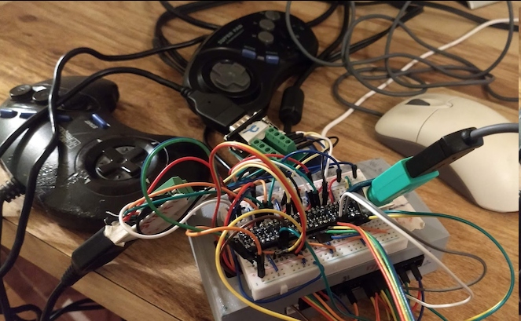
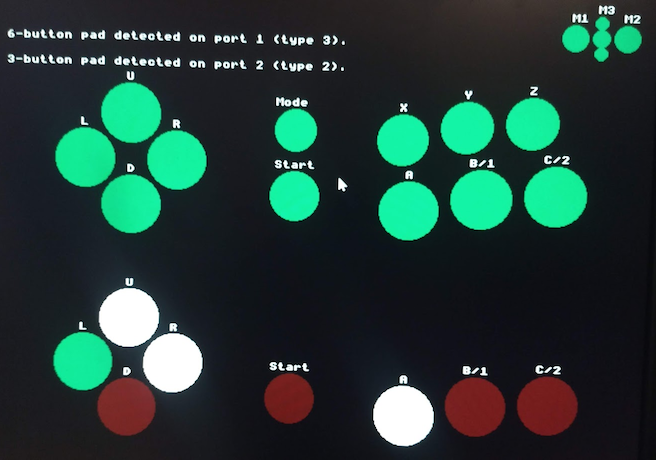

# Agon Light 2 - Mega I/O Adapter

 

Enables simultaneous support for a mouse and two game controllers. Supports Sega's 2-button, 3-button, and 6-button standards, but is still compatible with all software written for the Console8's 2-button controllers. 

This repo also contains a controller detection/testing program. I will release just the controller reading code by itself at some point. In the meantime, feel free to copy code from this repo (as long as you obey the license).


### How it works (history lesson)

The [Console8](https://heber.co.uk/agon-console8/) was the first system on the [Agon platform](https://agonconsole8.github.io/agon-docs/#what-is-the-agon-light-and-what-is-the-agon-console8) to feature built-in controller and mouse ports (wired in parallel with the GPIO port). Mice use a standard PS/2 connection and protocol. The controllers use the [Atari/Kempston standard](https://deskthority.net/wiki/Atari_interface), where each button is tied to a pin, and when the button is pressed, that pin changes from 5V to ground.

| **Pin 1** | **Pin 2** | **Pin 3** | **Pin 4** | **Pin 5** | **Pin 6** | **Pin 7** | **Pin 8** | **Pin 9** |
| --------- | --------- | --------- | --------- | --------- | --------- | --------- | --------- | --------- |
| Up        | Down      | Left      | Right     |           | Button 1  | 5V        | Ground    | Button 2  |

The Sega Master System uses a version of the Atari protocol. Sega moved the 5V line from pin 7 to pin 5, but for reasons I won't get into, Master System controllers will still work on the Console8.

| **Pin 1** | **Pin 2** | **Pin 3** | **Pin 4** | **Pin 5** | **Pin 6** | **Pin 7** | **Pin 8** | **Pin 9** |
| --------- | --------- | --------- | --------- | --------- | --------- | --------- | --------- | --------- |
| Up        | Down      | Left      | Right     | 5V        | Button 1  |           | Ground    | Button 2  |

The Sega Genesis/Mega Drive 3-button controller uses an evolution of the Master System protocol. To support more buttons on the same number of pins, Sega added a chip in the controller that toggles which set of buttons is currently being output, based on a SELECT line (pin 7).

Sega later released a 6-button controller for the Genesis, which works by toggling the SELECT line a bunch of times in quick succession, causing the controller to report another set of buttons.

| **Select?**  | **Pin 1** | **Pin 2** | **Pin 3** | **Pin 4** | **Pin 5** | **Pin 6** | **Pin 7** | **Pin 8** | **Pin 9** |
| ------------ | --------- | --------- | --------- | --------- | --------- | --------- | --------- | --------- | --------- |
| **Low**      | Up        | Down      | 0         | 0         | [5V]      | A         | [SELECT]  | [Ground]  | Start     |
| **High**     | Up        | Down      | Left      | Right     | [5V]      | B         | [SELECT]  | [Ground]  | C         |
| **6-button** | Z         | Y         | X         | Mode      | [5V]      | B         | [SELECT]  | [Ground]  | C         |

Because these controllers have chips in them that need power on pin 5, they won't work at all on the Console8. And even if they did, pin 7 will always be +5V, meaning it's impossible to read the extra buttons.

My adapter rectifies this by providing a new set of controller ports that send 5V to pin 5, and wire SELECT to a free GPIO pin that can be controlled in software. Otherwise, it uses the same pins the Console8 uses, for maximum software compatibility.


### Wiring

The controllers connect to **male** DB9 connectors. Some vendors order the pins on their connectors differently. These instructions assume pins on the male connector are ordered like this:

```
1 2 3 4 5
* * * * * 
 * * * *
 6 7 8 9
```

The mouse uses a standard PS/2 port.

Pins on the GPIO port are ordered top to bottom, then right to left; the top-right pin is pin 1, the bottom-right is pin 2, the bottom-left is pin 34, etc.

PS/2 mice and Genesis controllers both operate on 5V, but the Agon's GPIO pins are only 3.3V. Therefore, **all signals must go through a level shifter.** I use four separate 4-channel bidirectional level shifters to accomplish this, as there are 14 lines that need to be shifted, and that was the cheapest option. Make sure that all of the physical ports are on the 5V side, and all wires going to the GPIO port are on the 3.3V side. Also make sure all the level shifters are wired to ground and *both* voltages as per their instructions.

| **Input pin (5V)** | **GPIO pin\* (3.3V)** | **eZ80 Port** | **ESP32 port** | **Function**  |
| ------------------ | -------------------- | --------- | ---------- | ------------- |
| P1 pin 1           | Pin 18               | C, bit 1  |            | P1 Up/Z       |
| P1 pin 2           | Pin 20               | C, bit 3  |            | P1 Down/Y     |
| P1 pin 3           | Pin 22               | C, bit 5  |            | P1 Left/X     |
| P1 pin 4           | Pin 24               | C, bit 7  |            | P1 Right/Mode |
| P1 pin 5           | Pin 4                |           |            | +5V           |
| P1 pin 6           | Pin 14               | D, bit 5  |            | P1 A/B        |
| P1 pin 7           | Pin 26               | B, bit 5  |            | SELECT        |
| P1 pin 8           | Pin 3**              |           |            | GND           |
| P1 pin 9           | Pin 16               | D, bit 7  |            | P1 Start/C    |
| P2 pin 1           | Pin 17               | C, bit 0  |            | P2 Up/Z       |
| P2 pin 2           | Pin 19               | C, bit 2  |            | P2 Down/Y     |
| P2 pin 3           | Pin 21               | C, bit 4  |            | P2 Left/X     |
| P2 pin 4           | Pin 23               | C, bit 6  |            | P2 Right/Mode |
| P2 pin 5           | Pin 4                |           |            | +5V           |
| P2 pin 6           | Pin 13               | D, bit 4  |            | P2 A/B        |
| P2 pin 7           | Pin 26               | B, bit 5  |            | SELECT        |
| P2 pin 8           | Pin 3**              |           |            | GND           |
| P2 pin 9           | Pin 15               | D, bit 6  |            | P2 Start/C    |
| Mouse CLK          | Pin 9                |           | I/O 26     | Clock         |
| Mouse DAT          | Pin 8                |           | I/O 27     | Data          |
| Mouse VCC          | Pin 2                |           |            | +5V           |
| Mouse GND          | Pin 3**              |           |            | GND           |

*For the AL2 and Agon Origins. The original Agon Light lacks 5V, and the Console8 uses a completely different pin arrangement.

**Pins 5 and 33 can also be used as ground.


### Parts list
I bought all my parts on Amazon. I just went for the cheapest option for each component, and since prices change so much, I advise you to look up the parts yourself.
- 1x breadboard. A 400 point one is big enough, but cramped with wires. But if you make it any larger, you can't stick it on top of your Agon's case like I did.
- A bunch of wires. The exact amount depends on what other components you buy, but I needed roughly 20 male-to-male DuPont cables, 20 male-to-female DuPont cables, and a bunch of precut jumper wires to route voltage and ground to all the level shifters.
- 4x 4-channel 3.3V to 5V logic level converters. These are nothing but a few transistors and resistors placed on a tiny circuit board. You can get 8-channel ones, but it's cheaper to buy more of the smaller ones.
- 2x **Male** DB9 breakout adapters. I didn't have any luck finding ones I could plug directly into the breadboard, so these just kind of flop around behind it. If you find ones that plug in, get a bigger breadboard so you actually have somewhere to put them. Make sure they actually have 9 screw-in points - some only have three.
- 1x PS/2 mouse breakout adapter. Mine had four pins sticking out the back, which I could bend down and shove directly into the breadboard.


### Assembly instructions
Please reference the table in the Wiring section for exact pin numbers.
1. Wire one of the positive rails to the 5V GPIO pin, and the other to the 3.3V pin. Wire both negative rails to ground.
2. Place all the level shifters in a line, bridging the two halves of the breadboard. Make sure they're all facing the right way - they have a designated high-voltage and low-voltage side. I recommend putting all of the level shifters right next to each other, so you have room on the other end of the board to plug the PS/2 connector in.
3. Wire up all the level shifters. Usually, both sides have to be connected to ground, and each side will have a pin for the associated voltage (make sure 5V goes to the high-voltage side, and 3.3V to the low-volaage side). These pins are usually labeled "HV", "LV", and "GND". 
5. Connect a bunch of male-male cables to all of the pins of both DB9 adapters.
6. Wire up the 5V side of the board. The only rules are that 5V goes to the 5V rail, ground goes to ground, and both controllers' SELECT lines need to be wired in parallel to the same level shifter channel (since they're going to the same GPIO pin). Outside of that, you can allocate each controller pin (and the mouse's CLK and DAT pins) to level shifter channels however you wish, but it's best to keep the order somewhat sensible. (My order is UDLR12 for P1, then SELECT, then UDLR12 for P2, then mouse CLK and DAT on the end.) You should be using 15 of the 16 channels when you're done.
7. Wire up the 3.3V side of the board, by connecting the other end of all the level shifter channels to the appropriate GPIO pin.


### Notes

- The controller test appears to reveal some odd behaviors in the current firmware and the Agon emulator:
  - Mouse scroll wheel values reset to 0 only when moving the mouse. Feels like they should either never reset, or reset once the click ends... anyone know how PS/2 mice are supposed to work? Do I need to read the mouse sysvars differently?
  - The emulator lets you press all D-pad directions at once by making a circle motion, at least on Windows. Does not affect analog sticks.
  - The emulator does not recognize scroll wheel up or down.
  
- The controller test program is built using the [AgDev](https://github.com/pcawte/AgDev) toolchain. 
  
  - I build using VS Code tasks instead of running make directly. I recommend installing [this extension](https://marketplace.visualstudio.com/items?itemName=SanaAjani.taskrunnercode) so it's easier to run these. Currently these build tasks expect AgDev to sit at /../../agon and the emulator to sit at /../../fab-agon-emulator, relative to the project directory.
  
  - The code is kind of a mess in general. I have plans to improve it a bit, but I'm not sure how much I'll end up doing. Feel free to raise an issue if you know of a better way to do something (or if you find a bug).

- **any Atari-compatible sticks that use active circuitry should not be used with this adapter.** Most sticks are passive, and so won't have this problem, but if a controller actually *needs* to draw power from pin 7, it won't be able to, since that's the SELECT line now. Worst case is that the controller will also be unable to handle 5V sent in on pin 5, and it'll get fried!

- Controller data is stored in a 24-bit integer. Because of the way the Console8 allocated controller pins to GPIO ports, both controllers' buttons are interleaved. The order is UUDDLLRRCCBBSSAAZZYYXXMM. Player 2's inputs use the lesser bit.


### Special thanks and references
- This repo contains a few utility functions (put16, put24, get_port, set_port) written by [HeathenUK](https://github.com/HeathenUK) and posted in the [Agon & Console8 Discord](https://discord.gg/GYq43gsz). 
- [Richard Turnnige's Agon Bits examples](https://github.com/richardturnnidge/lessons) - the mouse and joystick examples helped me test the hardware before I wrote my own test app.
- [Wilbur McCalmont's 6-button timing notes](https://forums.atariage.com/topic/110392-sega-genesis-6-button-controller-waveforms/)
- [Plutiedev - Genesis controllers](https://plutiedev.com/controllers)
- [Polling the 6-button](https://web.archive.org/web/20130707235706/http://www.cs.cmu.edu/~chuck/infopg/segasix.txt)
- [Atari Interface - Deskthority Wiki](https://deskthority.net/wiki/Atari_interface#Pin-out)
